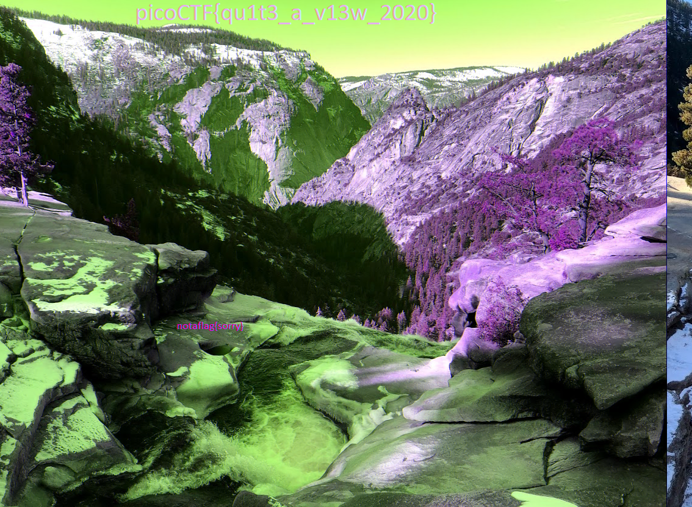

# tunn3l v1s10n
> 40 points 

## Description
We found this file. Recover the flag.
## Hints
<ol>
    <li>Weird that it won't display right...</li>
</ol> 

## Solution

- Running the `file` command on the file we see the image is corrupted.
- So we view it using `hexedit`... its a `bpm`file, Rename the file to `tunn3l_v1s10n.bmp`
- Still wont get the flag because the whole image is not visible

change the header 
### From:
```
42 4d 8e 26 2c 00 00 00 00 00 ba d0 00 00 ba d0
00 00 6e 04 00 00 32 01
```

### To:
```
42 4d 8e 26 2c 00 00 00 00 00 ba d0 00 00 28 00
00 00 6e 04 00 00 40 03
```

